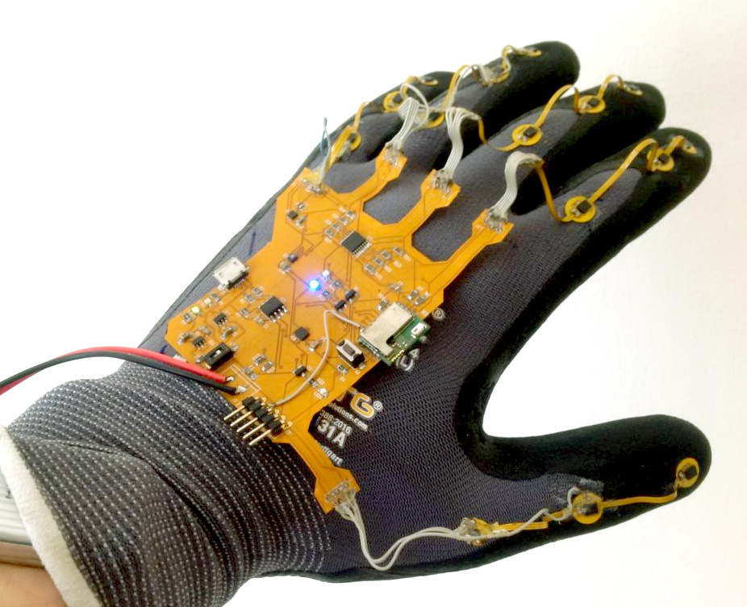
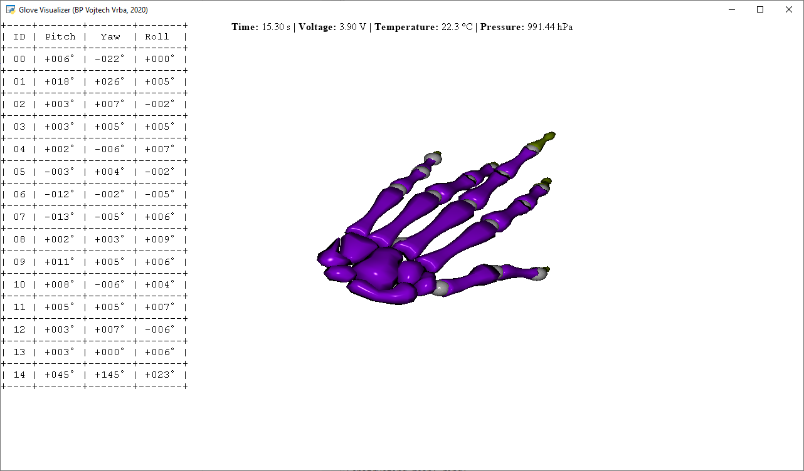

# Gloves Equipped with Motion Sensors (HW & FW & SW)
 This project was created as a part of my bachelor thesis at the Czech Technical University. It contains complete hardware, firmware and software designs for smart Bluetooth gloves equipped with 15 6-DOF IMU sensors.

## About the Bachelor Thesis (Abstract)

This bachelor thesis focuses on the development of gloves equipped with motion sensors. The result of this work is supposed to be a functional device including 3D visualisation of measured bending of all fingers, so hand gestures can be determined. First of all, the theory of Bluetooth Low Energy devices is presented.The next chapter contains an explanation of hardware design details. Then the software implementation for the programmable BLE module is presented. Explanation of the theory of quaternion representation of the rotation and orientation in space for Madgwick's AHRS algorithm can be also found in this work. Python language has been chosen for implementing the visualisation. The thesis is completed with achieved results and ideas for further development.

Full text (in Czech language) is available at: https://dspace.cvut.cz/handle/10467/87657?locale-attribute=en

## Repository Contents

* **Hardware folder** - Contains complete Autodesk EAGLE projects for all related PCBs, including PDF schematics and layout visualisations.
* **Gerber folder** - Contains GERBER production archives for all of the designed PCBs.
* **Firmware folder** - Contains complete Keil uVision project with the firmware for the STMicroelectronics BlueNRG-M2SA Bluetooth module.
* **Software folder** - Contains Python software used for processing of the IMU data and for the visualisation.

## 3D Visualisation Software

A screenshot of the Python visualiser and the static code analysis are shown below.

